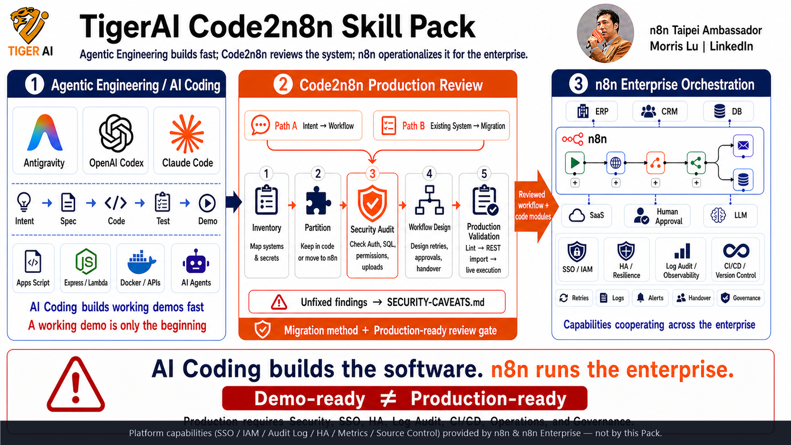

# TigerAI A2A Code2n8n Skill Pack — User Manual

> **TigerAI A2A Code2n8n Skill Pack — v1.0 Production-Grade Methodology**
> *AI-driven build of enterprise-grade n8n workflows from natural-language sticky notes or existing codebases. A2A-directed · 4-Tier dependency security CI-enforced · Path B real-vendor-sandbox runtime evidence.*

> 🌐 **English** | [繁體中文](README.zh.md)
> 📖 **Why Code2n8n?** Read the [Code2n8n manifesto](CODE2N8N.md) — why enterprises need n8n *more* in the AI-coding era, not less.

> ## 🚀 v1.0 release — evidence-first (per §1.6 lexical schema-before-claim rule)
>
> ### V&V evidence — gate v1
>
> **Layer 1 (structural)** — JSON parse PASS · `security-scan.mjs` 0 error / 20 documented warning · `live-roundtrip.mjs` 14/14 ok
>
> **Layer 2 (runtime — Path B einvoice case)**
> - svc: `npm install` / `npm audit --audit-level=high` / `tsc --noEmit` PASS (exact pins, `npm ci`-locked, CI fail-gate since v0.36.0)
> - End-to-end runtime against **real vendor sandbox**:
>   - Amego SDK capability — **10/10 PASS** (ISSUE / VOID / ALLOWANCE / VOID_ALLOWANCE / QUERY / B2B / MIXED_TAX / QUERY_BY_ORDER_ID / CARRIER mobile barcode / FOREIGN_CURRENCY)
>   - Amego DONATION (愛心碼): **PARTIAL** — Amego raw response does not echo the donation field (verification-method limitation, not a workflow bug)
>   - Amego SCHEDULED_ISSUE: SDK gap captured as [SEC-021](examples/einvoice-n8n/SECURITY-REVIEW.md) — mitigated via [`einvoice-capability-aware-gate`](examples/einvoice-n8n/workflows/einvoice-capability-aware-gate.workflow.json); upstream issue to be filed at `paid-tw/einvoice`
> - Real Amego sandbox invoice traces (queryable in Amego back-office): `AA26515011`, `AA26515012`, `A1781885120033`, `AA26515015`, `AA26515016`, `AA26515018`, `AA26515019`, `AA26515020` (11 traces total)
> - SEC entries: **20 ✅ FIXED · 1 OPEN (mitigated) · 1 documented meta-lesson** — see [SECURITY-REVIEW.md](examples/einvoice-n8n/SECURITY-REVIEW.md)
>
> ### Claim — Path B end-to-end (port → security review → real-vendor-sandbox runtime PASS)
>
> Evidence above is in place (per [V&V A2A directive](docs/code2n8n-vv-a2a.md), 11-language machine-readable spec). **v1.0 ships with**:
>
> - ✅ **Port** — [`@paid-tw/einvoice`](https://github.com/paid-tw/einvoice) TypeScript SDK (5 providers, MIG 4.0) → 80-line Hono `svc` + 14 n8n workflows
> - ✅ **Security review** — 22 SEC entries + 4-Tier external-dependency security CI auto-enforced ([posture](docs/external-package-security-posture.md), [A2A directive EN](docs/external-dependency-security-a2a.md) / [ZH](docs/external-dependency-security-a2a.zh.md))
> - ✅ **Real-vendor-sandbox runtime PASS** — Amego 10/10 SDK capability against real Amego public sandbox (runtime evidence in Layer 2 block above)
>
> **Closing report**: [`tests/v0.41-final-validation-report.md`](examples/einvoice-n8n/tests/v0.41-final-validation-report.md) · **Claims & evidence index**: [`docs/v1-claims-and-evidence.md`](docs/v1-claims-and-evidence.md)
>
> ### Honest scope (what v1.0 does **not** claim)
>
> - ❌ **All 5 e-invoice providers runtime-PASS** — only Amego has real-sandbox runtime evidence; ECPay / ezPay / ezPay cross-border / ezReceipt lack public sandbox accounts (structural OK; can be checked with the SDK's built-in `MockProvider` — see [SEC-022](examples/einvoice-n8n/SECURITY-REVIEW.md))
> - ❌ **All case studies enterprise-deployable** — only einvoice case CLEARED; GW admin / LINE cloud are structural-PASS pending caller credentials; LINE on-prem is marked **DO NOT DEPLOY AS-IS**
> - ❌ **npm dependencies are 100% safe** — 4-Tier governance blocks known failure modes; novel supply-chain attacks can always evade any single tool; the Pack offers defense-in-depth, not a 100% guarantee
> - ❌ **v1.0 is finished** — v1.0 = Path B's first end-to-end pass + all SEC entries public + governance SOPs landed. v1.x will continue to evolve

> **The Code2n8n positioning**: AI Coding (Claude Code / Codex / Antigravity) is great at *writing* code. n8n is great at making code *manageable by an enterprise*. This pack is the bridge — **describe a requirement, *or* point at an existing system** (Apps Script / Express / Lambda / Docker stack), and get a runnable n8n workflow that IT, operations, and managers can all read, audit, hand off, and govern.



> 🎯 **One-sentence positioning**: **This Pack is a porting / review / validation / governance method. n8n editions + your IT carry the enterprise platform capabilities.**
>
> 🤖 **AI agent consuming this Pack?** Read the **A2A (AI-to-AI) directive** before running any Code2n8n flow. It is available in 11 languages — every consuming LLM gets the gate in its primary language so the deterministic triggers and forbidden-phrase tables actually fire:
> [English](docs/code2n8n-vv-a2a.md) · [中文](docs/code2n8n-vv-a2a.zh.md) · [日本語](docs/code2n8n-vv-a2a.ja.md) · [한국어](docs/code2n8n-vv-a2a.ko.md) · [Français](docs/code2n8n-vv-a2a.fr.md) · [Deutsch](docs/code2n8n-vv-a2a.de.md) · [Español](docs/code2n8n-vv-a2a.es.md) · [Tiếng Việt](docs/code2n8n-vv-a2a.vi.md) · [ภาษาไทย](docs/code2n8n-vv-a2a.th.md) · [Bahasa Melayu](docs/code2n8n-vv-a2a.ms.md) · [Bahasa Indonesia](docs/code2n8n-vv-a2a.id.md).
>
> The directive gates when you may use the words "validated" / "tested" / "production-ready", what tools you must invoke, what evidence schema you must emit, and what phrases are forbidden until the gate passes. Skipping it produced the v0.27.0 incident captured in [`examples/einvoice-n8n/REFLECTION.md`](examples/einvoice-n8n/REFLECTION.md). Human reviewers use [`docs/code2n8n-vv-checklist.md`](docs/code2n8n-vv-checklist.md) instead.

### What this Pack is — and what it is not

| ✅ This Pack **is** | ⛔ This Pack **is not** |
| --- | --- |
| Migration methodology — Inventory → Partition → Workflow Design | A replacement for n8n Enterprise (SSO / IAM / HA / Audit / Source Control / Environments) |
| Security Review **gate** — SOPs, skill, positive + negative examples, deterministic scanner | A full SAST / DAST / fuzzer / static-analyser for arbitrary code |
| Validation SOP + first-line CI gate (lint, secret scan, manifest, installer, scanner, optional live round-trip) | A complete workflow-deployment pipeline (no staging promote / blue-green / automatic rollback yet) |
| Case-study evidence (3 real ports + 16 reviewable workflow JSONs) | A universal "code → workflow" compiler — Partition is a design decision, not auto-translation |
| Reference corpus (2,061 community workflows, MIT, secrets scrubbed) for design lookup | Validated production templates — the corpus is **lookup material**, not certified workflows |

Receipts for the ✅ column: [`docs/responsibility-matrix.md`](docs/responsibility-matrix.md) (status per claim) and [`tests/REPORT-v0.24.1-evidence.md`](tests/REPORT-v0.24.1-evidence.md) (fresh dated evidence).

> 📊 **The whole pack in one picture**: Natural-language intent *or* an existing program system → Code2n8n Skill Pack (Cookbook + 2,061 reference workflows *as a design-lookup corpus, not validated templates* + DSL v1.2 + **15 skills** + 4 enterprise patterns) → decides what logic stays as code vs lifts into an n8n node → emits a reviewable, hand-off-able, cross-system n8n workflow.
> *by n8n Taipei Ambassador Morris Lu*

---

## 🔄 Two Code2n8n paths

This pack does more than turn sticky notes into workflows. It supports two directions:

```text
Path A: from zero
natural language / yellow sticky note
  → sticky-note-to-workflow
  → n8n workflow

Path B: port an existing system
Apps Script / Express / Lambda / Netlify Functions / Docker stack
  → code-to-workflow (inventory, dedicated security gate, partition, port, validate, version/rollback evidence)
  → code modules + n8n workflow + migration docs
```

Code2n8n **does not transliterate every line of Python or JavaScript into nodes**. It re-partitions the system: complex algorithms stay in code, while triggers, cross-system wiring, retries, human approvals, notifications, and execution history lift into a visible, manageable workflow.

> **AI Coding solves "how is the function built"; Code2n8n solves "how is the capability modularized and governance-traced"** (per A2A directive + 4-Tier external-dependency security CI gates — see [v1-claims-and-evidence.md](docs/v1-claims-and-evidence.md))**; n8n solves "how the modules cooperate across the whole enterprise."**

### 🧪 Case study evidence — samples of the methodology applied, not the deliverable

> The deliverable is the **methodology + 15 SKILLs + templates + V&V gate (§10 two-layer + A2A 11-language + §1.6 lexical) + main/critic architecture** above. Case studies below are **evidence of methodology applied to real codebases**, kept in `examples/` as reference. More will be added as new GitHub repos go through the [`code2n8n-pipeline`](skills/tigerai/code2n8n-pipeline/SKILL.md) SKILL. Each case maintains its own `SECURITY-REVIEW.md` and (where the case surfaced new methodology gaps) `REFLECTION.md`.

| Case | Upstream → n8n | Methodology status |
|---|---|---|
| [Google Workspace admin](examples/google-workspace-admin-workflow/) | 1,373-line Apps Script → 7 workflows (core + entry + setup) | Static lint 0 err / 0 warn · n8n REST import 7/7 · live execution requires your Google Workspace credentials |
| [LINE customer service (cloud)](examples/line-ai-customer-service/) | Netlify + Supabase → core + entry + approach-C admin | Static lint 0 err / 0 warn · n8n REST import 6/6 · live execution requires your LINE + Supabase credentials |
| [LINE customer service (on-prem)](examples/line-ai-customer-service-onprem/) | Docker + Postgres + Redis + Qdrant + Ollama → 37-node brain | 5-phase V&V; security review concluded **BLOCKED — DO NOT DEPLOY AS-IS** (kept as teaching artefact, see [`SECURITY-REVIEW.md`](examples/line-ai-customer-service-onprem/SECURITY-REVIEW.md)) |
| [Taiwan e-invoice unified SDK](examples/einvoice-n8n/) ⭐ **v1.0 CLEARED** | TypeScript SDK ([`@paid-tw/einvoice`](https://github.com/paid-tw/einvoice), 5 providers, MIG 4.0) → 80-line Hono wrapper svc + 14 governance workflows | **First Path B case to ship CLEARED with real-vendor-sandbox runtime ground truth — the v1.0 milestone case.** Amego **10/10 SDK capability** verified against real Amego public sandbox (11 real invoice traces, see [v0.40 report](examples/einvoice-n8n/tests/v0.40-amego-full-coverage-report.md)); **22 SEC entries** in [`SECURITY-REVIEW.md`](examples/einvoice-n8n/SECURITY-REVIEW.md) (20 ✅ FIXED, 1 OPEN-but-mitigated SDK gap, 1 documented meta-lesson); **3 HITL versions** (v1 DIY / v2 Slack sendAndWait / v3 Form for Taiwan); 4-Tier external-dependency security CI auto-enforced; scanner 0 error / 20 documented warnings. **Closing report**: [`tests/v0.41-final-validation-report.md`](examples/einvoice-n8n/tests/v0.41-final-validation-report.md). Reflection on why bugs survived earlier review: [`REFLECTION.md`](examples/einvoice-n8n/REFLECTION.md). |

Each row is one sample. When a case surfaces a new failure mode (Code v2 contract drift, ghost cron, webhook-register asymmetry, etc.) the methodology upgrades — the case becomes a permanent record of what the upgrade was for.

> 🛠️ **Responsibility boundary**: The third block of the hero diagram ("n8n Enterprise Orchestration") lists SSO / IAM / audit log / HA — **n8n Enterprise ships these out of the box**, the Pack does not reimplement them. The Pack's job is to make sure Code2n8n-produced workflows *land cleanly* on top (IAM-friendly, queue-safe, rollback-traceable). The split between Pack / n8n Enterprise / your IT, and the workflow-design rules that follow, are in [`docs/enterprise-setup.md`](docs/enterprise-setup.md).
>
> 📊 **Per-claim honest status** (what's done / partial / out-of-scope, row by row): [`docs/responsibility-matrix.md`](docs/responsibility-matrix.md).

---

## 🤖 This is an Agentic Engineering Example

> **This entire project was authored using AI Agentic IDEs (Antigravity / Claude Code) — from spec to n8n workflows, every artifact was produced through human-AI agent collaboration.**

This Skill Pack is itself a working demo of **Agentic Engineering**:

| Dimension | Traditional way | This project (Agentic) |
|---|---|---|
| **Spec writing** | Engineer types every word | Chat with AI → AI produces SDD (Spec-Driven Design) |
| **n8n workflow dev** | Drag nodes on canvas | Write a yellow sticky note → AI emits runnable JSON |
| **Skill / plugin authoring** | Read docs, copy templates | Claude Code Skills + Antigravity `.agent/workflows/` orchestration |
| **Acceptance testing** | Run cases by hand, write report | AI runs 8 scenarios → auto-emits [`tests/REPORT-3.en.md`](tests/REPORT-3.en.md) |
| **Docs / README / CHANGELOG** | Backfilled after coding | Generated alongside code |
| **Third-party license compliance** | Manual review | AI detects leaked secrets, scrubs them, generates `THIRD_PARTY_NOTICES.md` |

### Agentic footprints in this repo

- **`skills/`** — `plugin.json` registers **15 Claude Code / Antigravity skills** (incl. v0.30.0 `code2n8n-pipeline` auto-pilot); each `SKILL.md` is co-authored by humans and AI
- **`.agent/workflows/`** — Antigravity-native agentic workflows (e.g. `/install-n8n-pack` one-shot installer)
- **`cookbook/`** — 8 natural-language → workflow examples showing how to "talk to" the AI
- **`spec/sticky-note-three-layer.md`** — Three-layer structure spec that forces reviewable AI output
- **`research/patterns.md`** — 7 canonical skeletons + anti-patterns mined by AI from 2,061 real workflows
- **`reference-workflows/`** — AI training corpus ([Zie619/n8n-workflows](https://github.com/Zie619/n8n-workflows), MIT, secrets scrubbed)

### Who should study this project

- Developers / PMs learning **how to use an AI agent as an engineering teammate**
- Teams who already have **Apps Script, Express, Lambda, Netlify Functions, or a Docker stack** and want to evaluate **what stays in code vs what moves into n8n**
- Teams evaluating **whether Antigravity / Claude Code can replace hand-written skills / workflows**
- Anyone curious **what real human-AI co-authored engineering output looks like**

> 💡 In other words: this isn't just "a Skill Pack for n8n" — it's also an open **case study of how AI agents build a real product**.

### 👥 You (the user) can build n8n workflows the same way

**Once you install this Skill Pack, you can author your own n8n workflows with the same agentic approach** — no node syntax to learn, no code to write:

| Tool | What you do | What the AI does |
|---|---|---|
| **Antigravity** | Open your n8n project in Antigravity, run `/install-n8n-pack`, then describe what you want in plain language | `.agent/workflows/` auto-reads your intent → emits workflow JSON → deploys via n8n API |
| **Claude Code (CLI / VS Code)** | Run `bash install.sh` (or `install.ps1`) in your working dir, then describe a new requirement *or* point at existing code | Skills auto-load → generate a workflow from scratch, or run the full Code2n8n port |
| **Any AI assistant (ChatGPT / Gemini)** | Paste an example from [`cookbook/`](cookbook/00-INDEX.en.md) as a few-shot prompt | Imitates the three-layer structure and emits a compliant workflow JSON |

**Typical interaction** (30-second mental model):

```text
You ──> AI: "Every weekday 9am, pull Shopify orders, build a daily
             report, email it to the boss; on failure post to Slack #ops"

AI ──> You: ✅ workflow.json generated (Schedule → Shopify → Code → Email + Error → Slack)
             ✅ Yellow sticky: your original requirement, preserved
             ✅ Blue sticky: which credentials, constraints, test method
             ✅ Deployed to your n8n via API, webhook URL: https://...
```

> 🎯 **The core idea**: Users don't need to memorise n8n node syntax — clear requirements are enough to get a structured, reviewable, maintainable workflow. **Calling it deployment-grade** still requires credential setup, live validation against real sandbox, and the [V&V A2A directive](docs/code2n8n-vv-a2a.md) two-layer gate must PASS — see [`v1-claims-and-evidence.md`](docs/v1-claims-and-evidence.md) for how we verify each claim.

If you already have code, don't rewrite it into a sticky note. Just say:

> "Use `code-to-workflow` to inventory this project, decide what stays in code vs moves to n8n; do the security audit first, then emit SDD, workflow, and validation results."

See [`02-USAGE-MODES.en.md`](02-USAGE-MODES.en.md) (three intent-driven modes) and [`03-FIRST-WORKFLOW.en.md`](03-FIRST-WORKFLOW.en.md) (15-minute hands-on); for porting existing code, go straight to [`code-to-workflow`](skills/tigerai/code-to-workflow/SKILL.md).

---

## 📖 Reading order (strongly recommended)

| # | File | Audience / Time |
|---|---|---|
| 0️⃣ | **This README.md** | Overview, start here (5 min) |
| 1️⃣ | [`01-INSTALL.en.md`](01-INSTALL.en.md) | First-time setup (10 min) |
| 2️⃣ | [`02-USAGE-MODES.en.md`](02-USAGE-MODES.en.md) | Pick your intent-driven usage style (5 min) |
| 3️⃣ | [`03-FIRST-WORKFLOW.en.md`](03-FIRST-WORKFLOW.en.md) | Hands-on: build your first workflow (15 min) |
| 4️⃣ | [`04-FAQ.en.md`](04-FAQ.en.md) | Reference when stuck |

---

## ⚡ Understand it in 90 seconds

### What it does

You drop a **yellow sticky note** on the n8n canvas and write (in any language):

```text
Every day at 9 AM, fetch sales data and email the daily report to my boss.
On failure, notify Slack #ops.
```

You ask AI to build it. The canvas now shows a complete workflow:

```
┌─ Yellow sticky: your requirement (preserved as-is)
├─ Middle: AI-generated nodes (Schedule → HTTP → Code → Email)
└─ Blue sticky: AI's notes (credentials needed, assumptions, limitations, how to test)
```

No code. No syntax to learn. No need to memorize n8n node names.

### Four usage modes

| Mode | When | Trigger phrase |
|---|---|---|
| 🪄 Cookbook copy | You know what you want, fast | Copy from [cookbook](cookbook/00-INDEX.en.md) |
| 💬 Q&A mode | You have no idea how to describe it | "enable Q&A mode" / "問答模式" |
| 🔍 Example finder | Want to see prior art first | "find examples for X" / "範例查詢" |
| 🔄 Code2n8n port | You have existing code or a system and want it governable in n8n | "Use `code-to-workflow` to analyse and port this project" |

The first three start from intent. The fourth starts from existing code. Full Code2n8n methodology: [`skills/tigerai/code-to-workflow/SKILL.md`](skills/tigerai/code-to-workflow/SKILL.md).

---

## 📂 Pack contents

```text
TigerAI-Code2n8n-Skill-Pack/
├── README.md / README.zh.md ← You are here
├── CODE2N8N.md              ← Code2n8n manifesto (positioning + thesis)
├── 01-INSTALL.md/.en.md       ← Install
├── 02-USAGE-MODES.md/.en.md   ← Three intent-driven usage modes
├── 03-FIRST-WORKFLOW.md/.en.md ← Hands-on tutorial
├── 04-FAQ.md/.en.md           ← Common questions
│
├── cookbook/                  ← 8 copy-paste recipes (each has plain-language + DSL fold)
│   └── 00-INDEX.md/.en.md
│
├── skills/                    ← 15 skills (plugin.json manifest matches on-disk)
│   ├── _vendor/                  6 vendor n8n-skills (MIT)
│   └── tigerai/                  8 TigerAI execution skills
│       ├── code-to-workflow/        ← Marquee: existing code / system → n8n
│       ├── n8n-security-governance/ ← Security + version control + CI/CD + rollback gate
│       └── n8n-code-to-native/      ← Code node → native n8n nodes
│
├── spec/                      ← Technical specs (for engineers)
│   ├── sticky-note-three-layer.md
│   └── sticky-note-dsl.md
│
├── examples/google-workspace-admin-workflow/    ← 1,373-line Apps Script → n8n
├── examples/line-ai-customer-service/           ← Cloud LINE CS → n8n + admin UI
├── examples/line-ai-customer-service-onprem/    ← On-prem Docker + Qdrant RAG (NOT deployable as-is)
├── examples/tigerai-flagship/ ← 3 enterprise-grade examples (with SDD)
├── reference-workflows/       ← 2,061 public workflows (AI corpus)
├── research/                  ← Research artifacts
├── tests/                     ← Three rounds of acceptance reports
│
├── CHANGELOG.md / VERSION
├── LICENSE                    ← Pack-wide MIT license
├── install.sh / install.ps1   ← Install scripts (supports Claude Code & Antigravity)
├── .agent/workflows/          ← Antigravity-exclusive workflows (e.g., /install-n8n-pack)
└── plugin.json                ← Skill manifest
```

> 📝 The `/install-n8n-pack` slash command lives in `.agent/workflows/install-pack.md` as an Antigravity-native workflow, not a Skill — so there is intentionally no `skills/tigerai/install-tigerai-n8n-pack/` folder. The manifest and disk both have 14 entries.

---

## 🎯 Suggested reading paths by role

### I'm new to n8n (never built a workflow)
1. This file → `01-INSTALL.en.md` → `03-FIRST-WORKFLOW.en.md`
2. After your first workflow runs, browse `cookbook/00-INDEX.en.md` for your scenario
3. Stuck? → `04-FAQ.en.md`

### I'm experienced with n8n, evaluating this Pack
1. This file → `02-USAGE-MODES.en.md`
2. Read `tests/REPORT-3.en.md`: historical acceptance baseline (v0.9.0 R3)
3. Browse any of the three Code2n8n case studies under [`examples/`](examples/) for current evidence
4. Browse `examples/tigerai-flagship/`: enterprise-grade SDD examples

### I'm an engineer / integrator
1. This file → `spec/sticky-note-three-layer.md` + `spec/sticky-note-dsl.md`
2. Porting existing code: `skills/tigerai/code-to-workflow/SKILL.md`
3. Security, version control, CI/CD, and rollback gate: `skills/tigerai/n8n-security-governance/SKILL.md`
4. Building from scratch intent: `skills/tigerai/sticky-note-to-workflow/SKILL.md`
5. `skills/tigerai/n8n-api-bridge/SKILL.md`: n8n REST API SOP
6. `research/patterns.md`: 7 standard skeletons + anti-patterns

### I have existing code I want to move into n8n
1. Read [`CODE2N8N.md`](CODE2N8N.md) first to understand the "keep in code / lift to flow" split
2. Use [`code-to-workflow`](skills/tigerai/code-to-workflow/SKILL.md) for source inventory, partitioning, and **Step 1.5 security audit**
3. Compare against the three empirical case studies: Google Workspace admin, LINE cloud, LINE on-prem
4. Pass static lint + n8n REST import, then end-to-end with real credentials
5. If security findings remain unfixed, per marquee skill hard rule §3, publish a `SECURITY-CAVEATS.md` — see the on-prem LINE CS example for the template

### I'm distributing this to my team
1. This file → run `01-INSTALL.en.md` end-to-end
2. Read `04-FAQ.en.md` to prepare for team questions
3. Hand the entire folder to teammates and ask them to start at this README

---

## ✨ The three-layer structure (one diagram)

```text
┌─────────────────────────────────────────────────────┐
│ 🟡 Layer 1 (yellow sticky): User intent              │
│    "Every day at 9 AM..."                            │
│    ← AI never modifies this. Always the source of    │
│      truth.                                          │
├─────────────────────────────────────────────────────┤
│    Layer 2: AI-generated nodes & connections        │
│    Schedule → HTTP → Code → Email                   │
├─────────────────────────────────────────────────────┤
│ 🔵 Layer 3 (blue sticky): AI's commentary            │
│    • Why each node was chosen                        │
│    • Required credentials                            │
│    • Assumptions and known limits                    │
│    • How to test                                     │
└─────────────────────────────────────────────────────┘
```

---

## 🛠️ Pain points this Pack solves

| Pain | Solution |
|---|---|
| AI-written workflows are inconsistent, hard to review | Enforce three-layer structure |
| Users don't know how to describe what they want | Plain-language stickies + 8 cookbooks + Q&A mode |
| AI doesn't know n8n well enough | 6 vendor official Skills + 2,061 workflow corpus |
| Don't know what existing code to keep vs move into n8n | `code-to-workflow` 7-step methodology + 3 empirical case studies |
| AI-written code demos fine but auth / SQL / secret management may not ship | Mandatory **Step 1.5 security audit**; unresolved findings disclosed via `SECURITY-CAVEATS.md` |
| No enterprise-grade patterns | 4 pillars: Atomic Orchestration / Universal Worker / SDD / Security |
| Don't know where to start | `03-FIRST-WORKFLOW.en.md` 15-min hands-on |

---

## 🧪 Code2n8n empirical case studies

| Case | Code2n8n path | Evidence |
|---|---|---|
| [Google Workspace admin workflow](examples/google-workspace-admin-workflow/) | 1,373-line Apps Script → core + entry n8n workflows | Line-by-line `PROVENANCE.md`; static lint 0 err / 0 warn; n8n REST import 7/7; live execution needs your Google Workspace credentials |
| [LINE AI customer service (cloud)](examples/line-ai-customer-service/) | Netlify Functions + Supabase → n8n runtime + approach-C admin UI | Static lint 0 err / 0 warn; n8n REST import 6/6; live execution needs your LINE + Supabase credentials |
| [LINE AI customer service (on-prem)](examples/line-ai-customer-service-onprem/) | Docker + Postgres + Redis + Qdrant + Ollama + n8n | 37-node workflow; 5-phase V&V; security audit disclosed major defects — **DO NOT DEPLOY AS-IS** |
| [**Taiwan e-invoice (einvoice-n8n)**](examples/einvoice-n8n/) ⭐ **v1.0 CLEARED** | `@paid-tw/einvoice` SDK (5 providers, MIG 4.0) → svc Hono wrapper + 14 n8n workflows | **Amego 10/10 SDK capability** PASS against real Amego sandbox (per [V&V A2A directive](docs/code2n8n-vv-a2a.md) — 11 real invoice traces `AA265149xx`–`AA265150xx`); 22 SEC entries tracked; 4-Tier external-dependency security CI-enforced; A2A directives in Chinese + English |

The third case deliberately preserves the upstream POC's security defects and documents them in [`SECURITY-CAVEATS.md`](examples/line-ai-customer-service-onprem/SECURITY-CAVEATS.md). This isn't "failed acceptance swept under the rug" — it's Code2n8n's core principle: **AI-written software that runs is not automatically software an enterprise can deploy.**

The fourth case (einvoice) is the **first to ship as CLEARED with real-vendor-sandbox runtime evidence** — see its [final validation report](examples/einvoice-n8n/tests/v0.41-final-validation-report.md).

---

## 🛡️ V&V + Security capabilities (what the Pack actually enforces)

> Pack 對外宣稱「能補足 AI Coding 的稽核、安全、透明可控」（[full story](docs/why-code2n8n-audit-security-transparency.md)）— 此 section 給工程主管 / 稽核 / 法遵窗口看真的 ship 了什麼。

### V&V two-layer gate（依 [A2A directive](docs/code2n8n-vv-a2a.md) 11 國語言 machine-readable）

| Layer | 工具 | 通過條件 |
| --- | --- | --- |
| **Layer 1** structural | `JSON.parse` + [`scripts/security-scan.mjs`](scripts/security-scan.mjs) + [`scripts/live-roundtrip.mjs`](scripts/live-roundtrip.mjs) | 0 error + N/N roundtrip |
| **Layer 2** runtime | `npm install/audit/tsc` + `/healthz` + auth 401 + body limit + op enum reject + per-workflow runtime contract + cross-document parity + **真實 vendor sandbox end-to-end smoke** | 詳見每案例 SECURITY-REVIEW + final-validation report |

[**§1.6 Lexical schema-before-claim rule**](skills/tigerai/code2n8n-pipeline/SKILL.md)：訊息含「validated / 驗證通過 / production-ready / X/X ok / 全綠」等受限字眼前，**同訊息更早位置必須先 emit 完整 evidence schema**。Critic gate lexical regex enforce — AI Coder 無法用「我覺得 OK」繞過。

### 4-Tier external-dependency security（v0.36-39 ship 完）

> 「我們對外部 GitHub 進來後有做 security check 嗎? 有對惡意程式處理嗎?」 — v0.35.0 自查答：有但是 advisory 等級。v0.36-39 升到自動 gate。詳見 [external-package-security-posture.md](docs/external-package-security-posture.md)。

| Tier | Release | 涵蓋 |
| --- | --- | --- |
| **Tier 1** 偵測層 | v0.36.0 | scanner 加 9 條 Code 節點惡意 jsCode pattern + npm audit 升 fail gate + svc deps caret → exact pin + socket.dev 整合 doc |
| **Tier 2** 限縮層 | v0.37.0 | container 硬化（USER 65534、npm ci、hash-pin base image）+ docker-compose runtime flags（read_only / cap_drop:[ALL] / tmpfs / secrets file-mount）+ SBOM (CycloneDX) CI artifact + Trivy gate（exit 1）+ Renovate 全 PR require human review + 外部 workflow JSON ingestion 三道 gate（scanner 0 error / 雙人 review marker / audit log） |
| **Tier 3** 治理層 | v0.38.0 | 新 [Skill external-dependency-security](skills/tigerai/external-dependency-security/SKILL.md) 9 § |
| **Tier 4** 自動 enforce 層 | v0.39.0 | Skill 規則升為**真實 gate**：CI `ext-dep-skill-enforcement` 4 道 + pre-commit hook + [`CODEOWNERS`](.github/CODEOWNERS) + [PR template](.github/pull_request_template.md) + [A2A directive 中英雙語](docs/external-dependency-security-a2a.md) |

### 惡性程式偵測（concrete patterns scanned）

[`security-scan.mjs`](scripts/security-scan.mjs) `MALICIOUS_JS_PATTERNS` 對 workflow JSON Code 節點 `jsCode` 抓 9 條：

| Severity | 抓什麼 |
| --- | --- |
| **error** | reverse-shell pattern · env-dump (`JSON.stringify(process.env)`) · dynamic-eval (`eval` / `new Function` / `vm.runInNewContext`) · `require('child_process'/'vm'/'dgram')` · 寫 sensitive 路徑（`/etc/` `/root/` `/home/` `C:\Windows`）· net-exfil (`fetch(...)` 含 credential-like names) |
| **warning** | `spawn` / `exec` / `execSync` · base64 large literal decode · `require('fs')` |

自製惡意 [fixture](scripts/__test__/malicious-fixture.workflow.json) 驗 **7 error + 4 warning 全捉**；Pack **30 個正當 workflow 0 false positive**。

外部來 workflow 進 Pack 走 [`scripts/ingest-external-workflow.mjs`](scripts/ingest-external-workflow.mjs) 三道 gate（scanner 0 error / 雙人 review marker `_pack_ingest` 含 submitter ≠ reviewer / node digest spot-check + JSONL audit log）。

### Case study 驗證信心對照

| Case | 驗證信心級別 | 證據類型 |
| --- | --- | --- |
| GW admin | 🟢 Layer 1 全綠 + 結構性 V&V | `PROVENANCE.md` + Pack 自家 scanner |
| LINE CS cloud | 🟢 Layer 1 全綠 + 結構性 V&V | scanner + live-roundtrip |
| LINE CS on-prem | 🟡 已 ship 但 SECURITY-CAVEATS 標 **DO NOT DEPLOY AS-IS** | 5-phase V&V + security audit disclosed defects |
| **einvoice** ⭐ | 🟢🟢 **真實 vendor sandbox runtime ground truth**（Amego 10/10）+ 22 SEC entry 全管理 + 4-Tier 自動 enforce | 11 張真實 Amego 發票 + final validation report |

einvoice 案例是 Pack 內**第一個** case study ship 真實 vendor sandbox runtime evidence。其他 case study 屬「結構層通過 + caller 需自己對接 production」。

---

## 📊 Historical baseline acceptance (v0.9.0 R3)

The numbers below were the real-environment baseline for three-layer workflow generation as of **v0.9.0 R3**; the current pack version is in [`VERSION`](VERSION), and the three Code2n8n case studies above plus [`tests/REPORT-v0.24.1-evidence.md`](tests/REPORT-v0.24.1-evidence.md) are the current-version evidence layer that supersedes pure-generation acceptance.

| Layer | Pass rate |
|---|---|
| JSON parse | 8/8 (100%) |
| n8n CLI Import | 8/8 (100%) |
| API Activate | 7/8 (87.5%) — T3 blocked by real Telegram bot token check |
| Webhook routing | 4/4 (100%) |
| Full execute success | 2/4 (with `continueOnFail` design) |

Details: [`tests/REPORT-3.en.md`](tests/REPORT-3.en.md).

---

## 🔢 Version & changelog

Current version: see [`VERSION`](VERSION). All changes: [`CHANGELOG.md`](CHANGELOG.md).

---

## 📜 License

**The whole pack is now MIT-licensed.** See the root [`LICENSE`](LICENSE) file.

- `skills/_vendor/`: MIT — from [czlonkowski/n8n-skills](https://github.com/czlonkowski/n8n-skills), see `skills/_vendor/LICENSE`
- `reference-workflows/`: MIT — from [Zie619/n8n-workflows](https://github.com/Zie619/n8n-workflows). API tokens, bearer tokens, and other secrets present in the original files have been replaced with placeholders (e.g. `YOUR_API_TOKEN_HERE`) before redistribution.
- `examples/line-ai-customer-service-onprem/`: derived from MIT-licensed `scorpioliu0953/ai_customer_service`, attribution chain in the example's `CREDITS.md`.
- `examples/einvoice-n8n/`: derived from MIT-licensed [`paid-tw/einvoice`](https://github.com/paid-tw/einvoice) TypeScript SDK (5 providers, MIG 4.0). The Pack's `svc/` Hono wrapper + 14 n8n workflows + SECURITY-REVIEW + Amego sandbox runtime test runner are MIT-authored by TigerAI on top of the upstream SDK. SDK adapter source code is consumed via `npm install @paid-tw/einvoice*` with exact-pin (per [SEC-017](examples/einvoice-n8n/SECURITY-REVIEW.md)); no SDK source is vendored into this repo.
- The rest (TigerAI-authored skills, cookbook, specs, docs, install scripts, manifesto, marquee `code-to-workflow` skill): **MIT** (Copyright (c) 2026 Morris Lu / TigerAI).

Full third-party notices: [`THIRD_PARTY_NOTICES.md`](THIRD_PARTY_NOTICES.md).

---

## 🆘 Stuck?

Tell Claude / ChatGPT:

> "I'm new to this. Following the TigerAI Skill Pack README, currently on [filename], hit [problem]."

The AI will diagnose. Or check [`04-FAQ.en.md`](04-FAQ.en.md) first.
