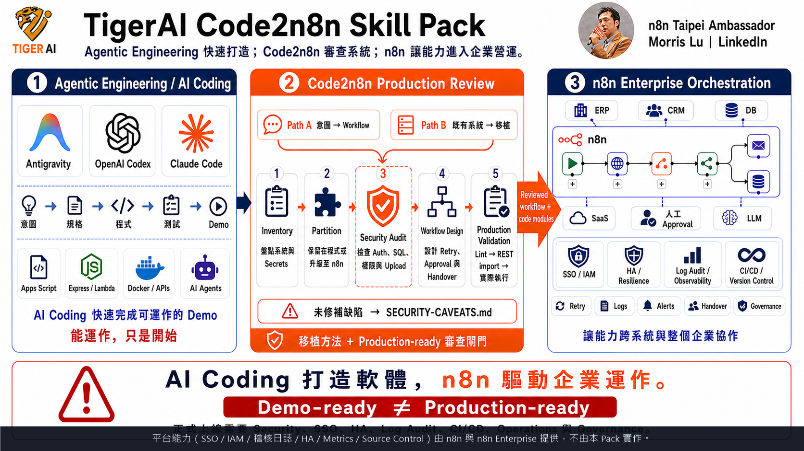

# TigerAI A2A Code2n8n Skill Pack — 使用手冊

> **TigerAI A2A Code2n8n Skill Pack — v1.0 Production-Grade Methodology**
> *用 AI 從自然語言 sticky note 或既有程式碼建構企業級 n8n workflow。A2A directive 驅動 · 4-Tier 外部依賴安全 CI 自動 enforce · Path B 真實 vendor sandbox runtime 證據。*

> 🌐 [English](README.md) | **繁體中文**
> 📖 **什麼是 Code2n8n？** 讀 [Code2n8n 宣言](CODE2N8N.md) — 為什麼 AI Coding 時代企業反而**更**需要 n8n。

> ## 🚀 v1.0 release — evidence-first（依 §1.6 lexical schema-before-claim rule）
>
> ### V&V evidence — gate v1
>
> **Layer 1（結構層）** — JSON parse PASS · `security-scan.mjs` 0 error / 20 documented warning · `live-roundtrip.mjs` 14/14 ok
>
> **Layer 2（runtime — Path B einvoice 案例）**
> - svc：`npm install` / `npm audit --audit-level=high` / `tsc --noEmit` PASS（exact pins、`npm ci` 鎖、CI fail-gate 自 v0.36.0 起綁定）
> - 對**真實 vendor sandbox** end-to-end runtime：
>   - Amego SDK capability — **10/10 PASS**（ISSUE / VOID / ALLOWANCE / VOID_ALLOWANCE / QUERY / B2B / MIXED_TAX / QUERY_BY_ORDER_ID / CARRIER 手機條碼 / FOREIGN_CURRENCY）
>   - Amego DONATION（愛心碼）：**PARTIAL** — Amego raw response 不 echo donation 欄位（verification-method 限制，非 workflow bug）
>   - Amego SCHEDULED_ISSUE：SDK gap 已 capture 為 [SEC-021](examples/einvoice-n8n/SECURITY-REVIEW.md) — 透過 [`einvoice-capability-aware-gate`](examples/einvoice-n8n/workflows/einvoice-capability-aware-gate.workflow.json) mitigate；upstream issue 將提至 `paid-tw/einvoice`
> - 真實 Amego sandbox 發票 trace（可在 Amego 後台查得）：`AA26515011` · `AA26515012` · `A1781885120033` · `AA26515015` · `AA26515016` · `AA26515018` · `AA26515019` · `AA26515020`（共 11 張）
> - SEC entries：**20 ✅ FIXED · 1 OPEN（mitigated）· 1 documented meta-lesson** — 見 [SECURITY-REVIEW.md](examples/einvoice-n8n/SECURITY-REVIEW.md)
>
> ### Claim — Path B 完整跑通（轉換 → 資安驗證 → 真實 sandbox runtime PASS）
>
> 上述 evidence 在席（依 [V&V A2A directive](docs/code2n8n-vv-a2a.md)，11 國語言 machine-readable spec）。**v1.0 ship 內容**：
>
> - ✅ **轉換** — [`@paid-tw/einvoice`](https://github.com/paid-tw/einvoice) TypeScript SDK（5 家供應商、MIG 4.0）→ 80 行 Hono `svc` + 14 個 n8n workflow
> - ✅ **資安驗證** — 22 SEC entries + 4-Tier 外部依賴安全 CI 自動 enforce（[posture](docs/external-package-security-posture.md)、[A2A directive 英文](docs/external-dependency-security-a2a.md) / [中文](docs/external-dependency-security-a2a.zh.md)）
> - ✅ **真實 sandbox runtime PASS** — Amego 10/10 SDK capability 對真實 Amego public sandbox PASS（runtime evidence 同上 Layer 2 區塊）
>
> **結案報告**：[`tests/v0.41-final-validation-report.md`](examples/einvoice-n8n/tests/v0.41-final-validation-report.md) · **Claims & evidence index**：[`docs/v1-claims-and-evidence.md`](docs/v1-claims-and-evidence.md)
>
> ### 誠實範圍（v1.0 **不**宣稱）
>
> - ❌ **5 家發票供應商全 runtime PASS** — 僅 Amego 有真實 sandbox runtime 證據；ECPay / ezPay / ezPay 跨境 / ezReceipt 無公開 sandbox 帳號（結構層 OK；可用 SDK 內建 `MockProvider` 驗 — 見 [SEC-022](examples/einvoice-n8n/SECURITY-REVIEW.md)）
> - ❌ **所有 case study 都可上線** — 只 einvoice 案例 CLEARED；GW admin / LINE cloud 結構層 PASS、需 caller credentials；LINE on-prem 標 **DO NOT DEPLOY AS-IS**
> - ❌ **npm 套件 100% 安全** — 4-Tier 治理擋住已知失敗模式；新型 supply chain 攻擊永遠可能繞過；本 Pack 提供 defense-in-depth，非 100% 保證
> - ❌ **v1.0 = 完成** — v1.0 = Path B 第一次完整跑通 + 全部 SEC entries 公開 + 治理 SOP 落地。v1.x 持續演進

> **Code2n8n 的定位**：AI Coding（Claude Code / Codex / Antigravity）擅長把程式「寫出來」；n8n 擅長把程式變成「企業管得住」的流程資產。這個 pack 就是兩者之間的橋 — **描述一個需求，或 指向一個既有系統**（Apps Script / Express / Lambda / Docker stack），產出 IT、營運、主管都看得懂、稽核得了、交接得下去、跨系統治理得來的 n8n workflow。



> 🎯 **一句話定位**：**本 Pack 是移植 / 審查 / 驗證 / 治理的「方法包」；n8n 版本 + 企業 IT 才承載企業平台能力。**
>
> 🤖 **AI agent 要使用本 Pack？** 跑任何 Code2n8n 流程**之前**，先讀 **A2A（AI-to-AI）指令**。提供 11 種語言，讓不同主要語言的 LLM 都能讀到母語版本、deterministic trigger 跟禁用詞表才會在那個語言的 prompt pattern 觸發：
> [English](docs/code2n8n-vv-a2a.md) · [中文](docs/code2n8n-vv-a2a.zh.md) · [日本語](docs/code2n8n-vv-a2a.ja.md) · [한국어](docs/code2n8n-vv-a2a.ko.md) · [Français](docs/code2n8n-vv-a2a.fr.md) · [Deutsch](docs/code2n8n-vv-a2a.de.md) · [Español](docs/code2n8n-vv-a2a.es.md) · [Tiếng Việt](docs/code2n8n-vv-a2a.vi.md) · [ภาษาไทย](docs/code2n8n-vv-a2a.th.md) · [Bahasa Melayu](docs/code2n8n-vv-a2a.ms.md) · [Bahasa Indonesia](docs/code2n8n-vv-a2a.id.md)。
>
> 指令明確規範：什麼時候才可以說「驗證通過 / 已測試 / 可上線」、要跑哪些工具、要產什麼 evidence schema、哪些詞彙在通過 gate 前是禁用的。跳過這個 gate 就是 v0.27.0 出事的原因，紀錄在 [`examples/einvoice-n8n/REFLECTION.md`](examples/einvoice-n8n/REFLECTION.md)。**人類** reviewer 改讀 [`docs/code2n8n-vv-checklist.md`](docs/code2n8n-vv-checklist.md)。

## 🆕 最新動態 — v1.0 把 paid-tw/einvoice 吸收進 n8n + 致謝

最近 Pack 把上游 SDK [`paid-tw/einvoice`](https://github.com/paid-tw/einvoice)（台灣統一電子發票 SDK，財政部 MIG 4.0 規格，5 家供應商：Amego / ECPay / ezPay / ezPay 跨境 / ezReceipt）完整移植成 n8n workflow，並完成 Path B 三段：

- ✅ **轉換**：SDK → 80 行 Hono `svc` 包裝 + 14 個 n8n workflow
- ✅ **資安審查**：22 個 SEC entry（20 ✅ FIXED + 1 OPEN mitigated + 1 documented）+ 4-Tier 外部依賴安全 CI 自動 enforce
- ✅ **真實 vendor sandbox runtime PASS**：Amego 10/10 SDK capability 對真實 Amego public sandbox 通過 — 11 張真實發票 trace 可在 Amego 後台查得（`AA26515011` ~ `AA26515020`）

V&V 證據（依上方 v1.0 release banner 與 [A2A directive](docs/code2n8n-vv-a2a.md)）：詳見 [`examples/einvoice-n8n/tests/v0.40-amego-full-coverage-report.md`](examples/einvoice-n8n/tests/v0.40-amego-full-coverage-report.md) + 結案報告 [`tests/v0.41-final-validation-report.md`](examples/einvoice-n8n/tests/v0.41-final-validation-report.md)。

### 🙏 致謝 [`paid-tw/einvoice`](https://github.com/paid-tw/einvoice) 維護者

MIT 授權讓本 Pack 能把 SDK 包成 svc + n8n 治理層對外發布 — 是 v1.0 milestone 能成立的關鍵基礎。本 Pack 透過 `npm install` exact-pin 引用該 SDK，**不 vendoring 原始碼**（依 [SEC-017](examples/einvoice-n8n/SECURITY-REVIEW.md)）。

我們也回饋一個 upstream issue draft 給 SDK 維護者：[`docs/upstream-issues/paid-tw-einvoice-sec-021-scheduled-issue.md`](docs/upstream-issues/paid-tw-einvoice-sec-021-scheduled-issue.md) — 真實 sandbox 測試時發現的 SDK `capabilities[]` 宣告與 `issue()` runtime 行為不一致問題（SCHEDULED_ISSUE 在 Amego 不支援卻被接受），含 reproducer + 提議的 fix。Pack 端已 mitigate via [`einvoice-capability-aware-gate`](examples/einvoice-n8n/workflows/einvoice-capability-aware-gate.workflow.json) workflow，但建議 SDK 層補上強制檢查。

### 本 Pack 是 / 不是什麼

| ✅ 本 Pack **是** | ⛔ 本 Pack **不是** |
| --- | --- |
| 移植方法論：Inventory → Partition → Workflow Design | n8n Enterprise 的替代品（SSO / IAM / HA / 稽核 / Source Control / Environments） |
| Security Review **關卡**：SOP、Skill、正反例範本、確定性掃描器 | 萬用程式 SAST / DAST / fuzzer / 靜態分析器 |
| 驗證 SOP + 第一線 CI gate（lint、secret scan、manifest、installer、scanner、optional live round-trip） | 完整 workflow deployment pipeline（尚未做 staging promote / blue-green / 自動 rollback） |
| 三個真實案例移植 + 16 個可審 workflow JSON | 萬用「程式碼 → workflow」compiler — Partition 是設計決策，不是自動翻譯 |
| 2,061 社群 workflow 參考語料（MIT、密鑰已 scrub）供設計查找 | 已驗證的 production 模板 — 是**查詢素材**，不是已驗收 workflow |

✅ 欄位的證據放這裡：[`docs/responsibility-matrix.md`](docs/responsibility-matrix.md)（逐項狀態）、[`tests/REPORT-v0.24.1-evidence.md`](tests/REPORT-v0.24.1-evidence.md)（最新驗收紀錄）。

> 📊 **一張圖看懂**：自然語言需求或既有程式系統 → Code2n8n Skill Pack（Cookbook + 2,061 參考 workflow *為設計查找語料，非已驗證模板* + DSL v1.2 + 15 個 Skill + 4 大企業模式）→ 分析哪些邏輯留在程式、哪些上升為 n8n 節點 → 產出可檢查、可交接、可跨系統編排的 workflow。
> *by n8n Taipei Ambassador Morris Lu*

---

## 🔄 兩條 Code2n8n 路徑

這個 Pack 不只會把便利貼變成 workflow。它支援兩個方向：

```text
路徑 A：從零開始
自然語言 / 黃色便利貼
  → sticky-note-to-workflow
  → n8n Workflow

路徑 B：移植既有系統
Apps Script / Express / Lambda / Netlify Functions / Docker stack
  → code-to-workflow（盤點、獨立安全閘門、分區、移植、驗證、版本與回滾證據）
  → 程式模組 + n8n Workflow + 移植文件
```

Code2n8n **不是逐行把 Python 或 JavaScript 翻成節點**。它做的是系統重新分工：複雜演算法留在程式，觸發、跨系統串接、重試、人工核准、通知與執行紀錄上升為可見、可管理的 workflow。

> **AI Coding 解決「功能怎麼做」；Code2n8n 解決「功能如何模組化與審查」；n8n 解決「模組如何與整個企業協作」。**

### 🧪 案例見證 — 方法論被套用後的樣本，不是 Pack 的賣點

> Pack 的賣點是上方的**方法論 + 15 個 SKILLs + templates + V&V gate（§10 兩層 + A2A 11 語 + §1.6 lexical）+ main/critic 雙 agent 架構**。下面這些案例是**方法論被套到真實程式碼後的樣本**，放在 `examples/` 當參考。每個案例獨立負責自己的 `SECURITY-REVIEW.md`（必要時還有 `REFLECTION.md`）。未來會有更多 GitHub repo 透過 [`code2n8n-pipeline`](skills/tigerai/code2n8n-pipeline/SKILL.md) SKILL 自動加入。

| 案例 | 上游 → n8n | 方法論套用紀錄 |
|---|---|---|
| [Google Workspace 行政流程](examples/google-workspace-admin-workflow/) | 1,373 行 Apps Script → 7 條 workflow（core + entry + setup） | 靜態 lint 0 err / 0 warn · n8n REST import 7/7 · 實際執行需自備 Google Workspace credential |
| [LINE AI 客服雲端版](examples/line-ai-customer-service/) | Netlify + Supabase → core + entry + approach C 後台 | 靜態 lint 0 err / 0 warn · n8n REST import 6/6 · 實際執行需自備 LINE + Supabase credential |
| [LINE AI 客服地端版](examples/line-ai-customer-service-onprem/) | Docker + Postgres + Redis + Qdrant + Ollama → 37 節點大腦 | 5 階段 V&V + ⚠️ `SECURITY-CAVEATS.md`（刻意保留不可上線、作為教學用） |
| [台灣電子發票統一 SDK](examples/einvoice-n8n/) | TypeScript SDK（[`MorrisLu-Taipei/einvoice`](https://github.com/MorrisLu-Taipei/einvoice)，5 家供應商）→ 80 行 Hono wrapper svc + 6 個治理 workflow | **驅動 §1.5 / §1.6 / SKILL Stage 8-10 contract checks 寫進方法論的那個案例**。v0.31.0 狀態：16 個 SEC-### 見 [`SECURITY-REVIEW.md`](examples/einvoice-n8n/SECURITY-REVIEW.md)（13 修、3 追蹤）· svc tsc 0 err / npm audit 0 high+ CVE · scanner 0 err / 3 expected warn · REST import 6/6 · 完整 runtime 測試矩陣見 [`tests/v0.31-local-sim-runtime-report.md`](examples/einvoice-n8n/tests/v0.31-local-sim-runtime-report.md)，涵蓋 Amego 全生命週期（issue / void / query / idempotency）對真實 Amego 公開 sandbox、5 家 vendor capability、svc 信任邊界、Sheet + Slack 本地 simulator、sandbox 失敗注入機制、1 個 n8n end-to-end happy path；其他 5 個 workflow + 4 家 vendor 的 n8n-level end-to-end 排 v0.32+。詳細反思見 [`REFLECTION.md`](examples/einvoice-n8n/REFLECTION.md)。 |

每一列是一個樣本。當某個案例暴露出新的失敗模式（Code v2 contract drift、ghost cron、webhook 註冊不對稱等），**方法論升級** — 該案例成為「升級為什麼存在」的永久紀錄。

> 🛠️ **責任邊界**：Hero 圖第三塊「n8n Enterprise Orchestration」裡的 SSO / IAM / 稽核日誌 / HA — **升 n8n Enterprise 開箱即有**，Pack 不重做。Pack 的工作是讓 Code2n8n 產出的 workflow **跑在 Enterprise 之上不會破洞**（IAM-friendly、queue-safe、可 rollback）。誰做什麼、workflow 怎麼接，見 [`docs/enterprise-setup.md`](docs/enterprise-setup.md)。
>
> 📊 **逐條完成度誠實表**（哪些已完成 / 部分 / 不在 Pack scope 內）：[`docs/responsibility-matrix.md`](docs/responsibility-matrix.md)。

---

## 🤖 這是一個 Agentic Engineering Example

> **本專案完全使用 AI Agentic IDE（Antigravity / Claude Code）撰寫，從規格到 n8n Workflow 全程由 AI 代理人協作完成。**

這個 Skill Pack 本身就是「AI 代理工程（Agentic Engineering）」的實作示範：

| 維度 | 傳統做法 | 本專案做法（Agentic） |
|---|---|---|
| **規格撰寫** | 工程師逐字打 spec | 跟 AI 對話 → AI 產出 SDD（Spec-Driven Design） |
| **n8n Workflow 開發** | 在畫布上手動拖節點 | 黃色便利貼寫需求 → AI 直接產出可執行 JSON |
| **Skill / Plugin 製作** | 翻文件、寫範本 | Claude Code Skills + Antigravity `.agent/workflows/` 自動編排 |
| **驗收測試** | 手動跑 case、寫報告 | AI 自跑 8 情境 → 自動產出 [`tests/REPORT-3.md`](tests/REPORT-3.md) |
| **文件 / README / CHANGELOG** | 開發完才補 | AI 與程式碼同步生成 |
| **第三方授權合規** | 人工審查 | AI 偵測密鑰外洩、scrub、產生 `THIRD_PARTY_NOTICES.md` |

### 你會在這個 repo 看到的 Agentic 痕跡

- **`skills/`** — `plugin.json` 登錄 15 個 Claude Code / Antigravity Skill（含 v0.30.0 新增 `code2n8n-pipeline` 自動駕駛 SKILL），每個 SKILL.md 都是 AI 與人共筆
- **`.agent/workflows/`** — Antigravity 專屬的 agentic workflow（如 `/install-n8n-pack` 一鍵安裝）
- **`cookbook/`** — 8 個自然語言 → workflow 的對照範例，示範如何「對 AI 講話」
- **`spec/sticky-note-three-layer.md`** — 三層結構規範，強制 AI 產出可 review 的 workflow
- **`research/patterns.md`** — AI 從 2,061 個真實 workflow 歸納出 7 大骨架 + 反模式
- **`reference-workflows/`** — AI 對照語料（[Zie619/n8n-workflows](https://github.com/Zie619/n8n-workflows) MIT，已 scrub 密鑰）

### 適合誰參考這個專案

- 想學「**怎麼把 AI Agent 當工程同事用**」的開發者 / PM
- 已有 Apps Script、Express、Lambda、Netlify Functions 或 Docker 系統，想評估「**哪些留在程式、哪些移到 n8n**」的工程團隊
- 評估「**Antigravity / Claude Code 能否取代手寫 Skill / Workflow**」的團隊
- 想看「**人 + AI 協作的真實工程產出長什麼樣**」的好奇者

> 💡 換句話說：這不只是「給 n8n 用的 Skill Pack」，更是一份**「AI Agent 怎麼蓋產品」的開源教材**。

### 👥 你（使用者）也可以這樣用

**裝上這個 Skill Pack 之後，你就能用同樣的 Agentic 方式打造自己的 n8n workflow** —— 完全不用學 n8n 節點語法，也不用寫程式：

| 工具 | 你怎麼做 | AI 幫你做什麼 |
|---|---|---|
| **Antigravity** | 在 Antigravity 開啟你的 n8n 專案，輸入 `/install-n8n-pack` 一鍵安裝，然後直接用自然語言描述 | 透過 `.agent/workflows/` 自動讀取需求 → 產生 workflow JSON → 透過 n8n API 部署 |
| **Claude Code (CLI / VS Code)** | 在你的工作目錄跑 `bash install.sh`（或 `install.ps1`），然後描述新需求或指定既有程式 | Skill 自動載入 → 從零產生 workflow，或執行 Code2n8n 系統移植 |
| **任何 AI 助理（ChatGPT / Gemini）** | 把 [`cookbook/`](cookbook/00-INDEX.md) 範例貼給它當 few-shot | 模仿三層結構，產出符合規範的 workflow JSON |

**典型對話流程**（30 秒理解）：

```text
你 ──> AI：「每天早上 9 點抓 Shopify 訂單，整理成日報寄給老闆，
              失敗就在 Slack #ops 通知」

AI ──> 你：✅ 已產生 workflow.json（Schedule → Shopify → Code → Email + Error → Slack）
            ✅ 黃便利貼：保留你的原始需求
            ✅ 藍便利貼：要設哪些 credential、限制、測試方法
            ✅ 已透過 n8n API 部署到你的環境，webhook URL：https://...
```

> 🎯 **核心精神**：使用者不需要先背熟 n8n 節點語法，只要能說清楚需求，就能產出有結構、可 review、可維護的 workflow。要宣稱可上線，仍必須完成 credential 設定、真實執行驗證與安全審查。

如果你已經有程式，不要先改寫成便利貼。直接說：

> 「請用 `code-to-workflow` 盤點這個專案，判斷哪些邏輯留在程式、哪些應移到 n8n；先做安全審查，再產出 SDD、workflow 與驗證結果。」

詳見 [`02-USAGE-MODES.md`](02-USAGE-MODES.md)（三種從零使用模式）與 [`03-FIRST-WORKFLOW.md`](03-FIRST-WORKFLOW.md)（15 分鐘手把手）；既有程式移植則直接使用 [`code-to-workflow`](skills/tigerai/code-to-workflow/SKILL.md)。

---

## 📖 閱讀順序（強烈建議照順序看）

| # | 檔案 | 適合誰 / 看多久 |
|---|---|---|
| 0️⃣ | **本檔 README.md** | 第一站總覽（5 分鐘） |
| 1️⃣ | [`01-INSTALL.md`](01-INSTALL.md) | 第一次設定（10 分鐘） |
| 2️⃣ | [`02-USAGE-MODES.md`](02-USAGE-MODES.md) | 三種從零使用模式怎麼選（5 分鐘） |
| 3️⃣ | [`03-FIRST-WORKFLOW.md`](03-FIRST-WORKFLOW.md) | 跟我做：產出第一個 workflow（15 分鐘 hands-on） |
| 4️⃣ | [`04-FAQ.md`](04-FAQ.md) | 卡關時查（隨時翻） |

---

## ⚡ 90 秒快速理解

### 它能做什麼

你在 n8n 畫布貼一張**黃色便利貼**，用中文（或英文）寫：

```text
每天早上 9 點抓銷售資料寄日報給老闆。
失敗就在 Slack #ops 通知。
```

呼叫 AI，畫布上就出現完整 workflow：

```
┌─ 黃便利貼：你寫的需求（保留）
├─ 中間：AI 產的節點：Schedule → HTTP → Code → Email
└─ 藍便利貼：AI 寫的說明：要哪些 credential、假設、限制、測試方法
```

不用寫程式，不用學語法，不用記 n8n 節點名稱。

### 四種使用方式

| 模式 | 何時用 | 觸發詞 |
|---|---|---|
| 🪄 Cookbook 照抄 | 知道要什麼，要最快 | 直接複製 [cookbook](cookbook/00-INDEX.md) 範例 |
| 💬 問答模式 | 完全不會描述需求 | 「啟用問答模式」 |
| 🔍 範例查詢 | 想先看別人怎麼做 | 「找跟 X 相關的範例」 |
| 🔄 Code2n8n 移植 | 已有程式或系統，想搬進 n8n 治理 | 「用 `code-to-workflow` 分析並移植這個專案」 |

前三種從「意圖」開始，第四種從「既有程式」開始。Code2n8n 移植的完整方法論見 [`skills/tigerai/code-to-workflow/SKILL.md`](skills/tigerai/code-to-workflow/SKILL.md)。

---

## 📂 Pack 內容

```text
TigerAI-Code2n8n-Skill-Pack/
├── README.md                  ← 你在這裡
├── CODE2N8N.md                ← Code2n8n 宣言（定位與核心論點）
├── 01-INSTALL.md              ← 安裝步驟
├── 02-USAGE-MODES.md          ← 三種從零使用模式
├── 03-FIRST-WORKFLOW.md       ← 跟我做：第一個 workflow
├── 04-FAQ.md                  ← 常見問題
│
├── cookbook/                  ← 8 個照抄範例（每個有自然語言版 + DSL 折疊）
│   └── 00-INDEX.md
│
├── skills/                    ← 15 個 Skill（plugin.json manifest 與磁碟一致）
│   ├── _vendor/                  6 個 vendor n8n-skills（MIT）
│   └── tigerai/                  8 個 TigerAI 執行 Skill
│       ├── code-to-workflow/        ← 旗艦：既有程式 / 系統 → n8n
│       ├── n8n-security-governance/ ← 安全、版本控制、CI/CD、回滾閘門
│       └── n8n-code-to-native/      ← Code node → 原生 n8n node
│
├── spec/                      ← 技術規範（給工程師）
│   ├── sticky-note-three-layer.md
│   └── sticky-note-dsl.md
│
├── examples/google-workspace-admin-workflow/    ← 1,373 行 Apps Script → n8n
├── examples/line-ai-customer-service/           ← 雲端 LINE 客服 → n8n + 後台
├── examples/line-ai-customer-service-onprem/    ← 地端 Docker + Qdrant RAG（不可直接上線）
├── examples/tigerai-flagship/ ← 3 個企業級範例（含 SDD）
├── reference-workflows/       ← 2,061 個公開 workflow（AI 對照語料）
├── research/                  ← 研究與統計（給工程師）
├── tests/                     ← 三輪驗收紀錄
│
├── CHANGELOG.md / VERSION
├── LICENSE                    ← 整套 Pack 的 MIT 授權
├── install.sh / install.ps1   ← 安裝腳本（支援 Claude Code 與 Antigravity）
├── .agent/workflows/          ← Antigravity 專屬自動化流程（如 /install-n8n-pack）
└── plugin.json                ← Skill 清單
```

> 📝 安裝對應的 slash command（`/install-n8n-pack`）放在 `.agent/workflows/install-pack.md`（Antigravity 原生流程），不是 Skill；因此沒有對應的 `skills/tigerai/install-tigerai-n8n-pack/` 目錄。

---

## 🎯 不同身份建議的閱讀路徑

### 我是 n8n 新手（沒寫過 workflow）
1. 本檔 → `01-INSTALL.md` → `03-FIRST-WORKFLOW.md`
2. 跑通第一個後，回 `cookbook/00-INDEX.md` 找你要的場景
3. 卡關 → `04-FAQ.md`

### 我是 n8n 老手，想評估這套值不值得用
1. 本檔 → `02-USAGE-MODES.md`
2. 看 `tests/REPORT-3.md`：真實 n8n 環境驗收成績
3. 看 `examples/tigerai-flagship/`：企業級範例 SDD

### 我是工程師 / 整合者
1. 本檔 → `spec/sticky-note-three-layer.md` + `spec/sticky-note-dsl.md`
2. 有既有程式要移植：`skills/tigerai/code-to-workflow/SKILL.md`
3. 安全、版本控制、CI/CD 與回滾閘門：`skills/tigerai/n8n-security-governance/SKILL.md`
4. 從零需求產 workflow：`skills/tigerai/sticky-note-to-workflow/SKILL.md`
5. `skills/tigerai/n8n-api-bridge/SKILL.md`：n8n REST API SOP
6. `research/patterns.md`：7 大標準骨架 + 反模式

### 我有既有程式，想搬到 n8n
1. 先讀 [`CODE2N8N.md`](CODE2N8N.md) 理解「保留程式 + 上升流程」的分工
2. 用 [`code-to-workflow`](skills/tigerai/code-to-workflow/SKILL.md) 做 source inventory、分區與 Step 1.5 安全審查
3. 對照三個實證案例：Google Workspace、LINE 雲端版、LINE 地端版
4. 通過靜態 lint、n8n REST import，再使用真實 credential 做端到端驗證

### 我要分發給內部團隊用
1. 本檔 → `01-INSTALL.md` 跑通
2. 讀 `04-FAQ.md` 把問題答案準備好
3. 把整個資料夾打包給團隊，請他們從本 README 開始讀

---

## ✨ 三層結構（一張圖看懂）

```text
┌─────────────────────────────────────────────────────┐
│ 🟡 Layer 1（黃色便利貼）：使用者需求                │
│    「每天早上 9 點...」                              │
│    ← AI 不會改它，永遠是 source of truth             │
├─────────────────────────────────────────────────────┤
│    Layer 2：AI 產出的 nodes 與連線                  │
│    Schedule → HTTP → Code → Email                   │
├─────────────────────────────────────────────────────┤
│ 🔵 Layer 3（藍色便利貼）：AI 回寫的說明             │
│    • 節點選型理由                                    │
│    • 你需要設哪些 credential                         │
│    • 前提假設與已知限制                              │
│    • 怎麼測試                                        │
└─────────────────────────────────────────────────────┘
```

---

## 🛠️ Pack 解決的痛點

| 痛點 | 解法 |
|---|---|
| AI 寫的 workflow 不一致、難 review | 強制三層結構 |
| 使用者不會寫需求給 AI | 自然語言便利貼 + 8 個 cookbook + 問答模式 |
| AI 不夠懂 n8n | 沿用 6 個官方 Skill + 2,061 個 workflow 語料 |
| 不知道既有程式哪些該留、哪些該移到 n8n | `code-to-workflow` 7 步驟移植方法論 + 三個實證案例 |
| AI 寫的程式能 demo，但認證、SQL 與秘密管理可能不能上線 | 強制 Step 1.5 security audit；未修補的缺陷必須用 `SECURITY-CAVEATS.md` 公開揭露 |
| 沒有企業級模式 | 4 大支柱：原子化 / Universal Worker / SDD / 安全 |
| 不知怎麼開始 | `03-FIRST-WORKFLOW.md` 15 分鐘手把手 |

---

## 🧪 Code2n8n 實證案例

| 案例 | Code2n8n 路徑 | 證據 |
|---|---|---|
| [Google Workspace 行政流程](examples/google-workspace-admin-workflow/) | 1,373 行 Apps Script → core + entry n8n workflows | `PROVENANCE.md` 逐項對照；靜態 lint 0 err / 0 warn；n8n REST import 7/7；實際執行需自備 Google Workspace credential |
| [LINE AI 客服雲端版](examples/line-ai-customer-service/) | Netlify Functions + Supabase → n8n runtime + approach C 後台 | 靜態 lint 0 err / 0 warn；n8n REST import 6/6；實際執行需自備 LINE + Supabase credential |
| [LINE AI 客服地端版](examples/line-ai-customer-service-onprem/) | Docker + Postgres + Redis + Qdrant + Ollama + n8n | 37 節點 workflow、5 階段 V&V；安全審查揭露重大缺陷，**不可直接上線** |
| [**台灣電子發票（einvoice-n8n）**](examples/einvoice-n8n/) ⭐ **v1.0 CLEARED** | `@paid-tw/einvoice` SDK（5 家供應商、MIG 4.0）→ Hono `svc` 包裝 + 14 個 n8n workflow | **Amego 10/10 SDK capability 對真實 Amego sandbox PASS**（11 張真實發票 trace）；22 個 SEC entries（20 ✅ / 1 mitigated / 1 documented）；4-Tier 外部依賴安全 CI 自動 enforce；A2A directives 中文 + 英文版 |

第三個案例刻意保留上游 POC 的安全缺陷並公開記錄於 [`SECURITY-CAVEATS.md`](examples/line-ai-customer-service-onprem/SECURITY-CAVEATS.md)。這不是「驗收失敗被藏起來」，而是 Code2n8n 的核心原則：**AI 寫的能跑，不代表企業能上線。**

第四個案例（einvoice）是 **Pack 內第一個 ship CLEARED 的 case**，有真實 vendor sandbox runtime 證據 — 詳見其 [結案驗證報告](examples/einvoice-n8n/tests/v0.41-final-validation-report.md)。

---

## 📊 歷史驗收基準（v0.9.0 R3）

以下是三層 workflow 生成能力在 v0.9.0 R3 時建立的真實環境基準；目前 Pack 版本見 [`VERSION`](VERSION)，上方三個 Code2n8n 案例與 [`tests/REPORT-v0.24.1-evidence.md`](tests/REPORT-v0.24.1-evidence.md) 是當前版本的驗證證據。

| 層 | 通過率 |
|---|---|
| JSON 結構解析 | 8/8 (100%) |
| n8n CLI Import | 8/8 (100%) |
| API Activate | 7/8 (87.5%) — T3 因 Telegram bot token 真實檢查 |
| Webhook 路由正確 | 4/4 (100%) |
| 完整 execute success | 2/4（含 `continueOnFail` 設計）|

詳見 [`tests/REPORT-3.md`](tests/REPORT-3.md)。

---

## 🔢 版本與變更紀錄

當前版本見 [`VERSION`](VERSION)；歷次變更見 [`CHANGELOG.md`](CHANGELOG.md)。

---

## 📜 授權

**整套 pack 現已採 MIT 授權。** 見根目錄 [`LICENSE`](LICENSE)。

- `skills/_vendor/`：MIT — 來自 [czlonkowski/n8n-skills](https://github.com/czlonkowski/n8n-skills)，見 `skills/_vendor/LICENSE`
- `reference-workflows/`：MIT — 來自 [Zie619/n8n-workflows](https://github.com/Zie619/n8n-workflows)。原始檔內的 API token / bearer token 等密鑰，於收錄前已替換為佔位符（如 `YOUR_API_TOKEN_HERE`）
- `examples/line-ai-customer-service-onprem/`：MIT 授權衍生自 `scorpioliu0953/ai_customer_service`，出處鏈見該範例的 `CREDITS.md`
- `examples/einvoice-n8n/`：MIT 授權衍生自 [`paid-tw/einvoice`](https://github.com/paid-tw/einvoice) TypeScript SDK（5 家供應商、MIG 4.0）。Pack 的 `svc/` Hono wrapper + 14 個 n8n workflow + SECURITY-REVIEW + Amego sandbox runtime 測試 runner 為 TigerAI MIT 自製。SDK adapter 透過 `npm install @paid-tw/einvoice*` exact-pin 引用（依 [SEC-017](examples/einvoice-n8n/SECURITY-REVIEW.md)）；本 repo **不** vendoring SDK source。
- 其餘（TigerAI 自製 skills、cookbook、spec、docs、安裝腳本、Code2n8n 宣言、marquee `code-to-workflow` skill 等）：**MIT**（Copyright (c) 2026 Morris Lu / TigerAI）

完整第三方授權聲明見 [`THIRD_PARTY_NOTICES.md`](THIRD_PARTY_NOTICES.md)。

---

## 🆘 卡關了？

對 AI（Claude / ChatGPT）說：

> 「我是新手，跟著 TigerAI Skill Pack 的 README 在做，目前看到 [檔名]，遇到 [問題]」

AI 會接手診斷。或先翻 [`04-FAQ.md`](04-FAQ.md)。
